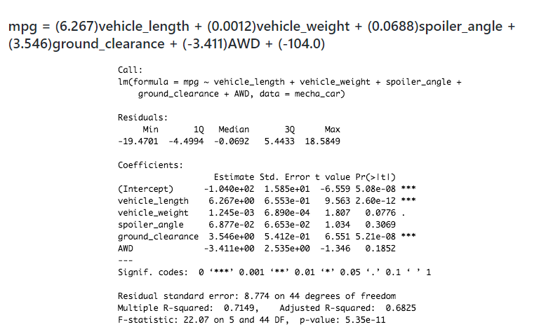
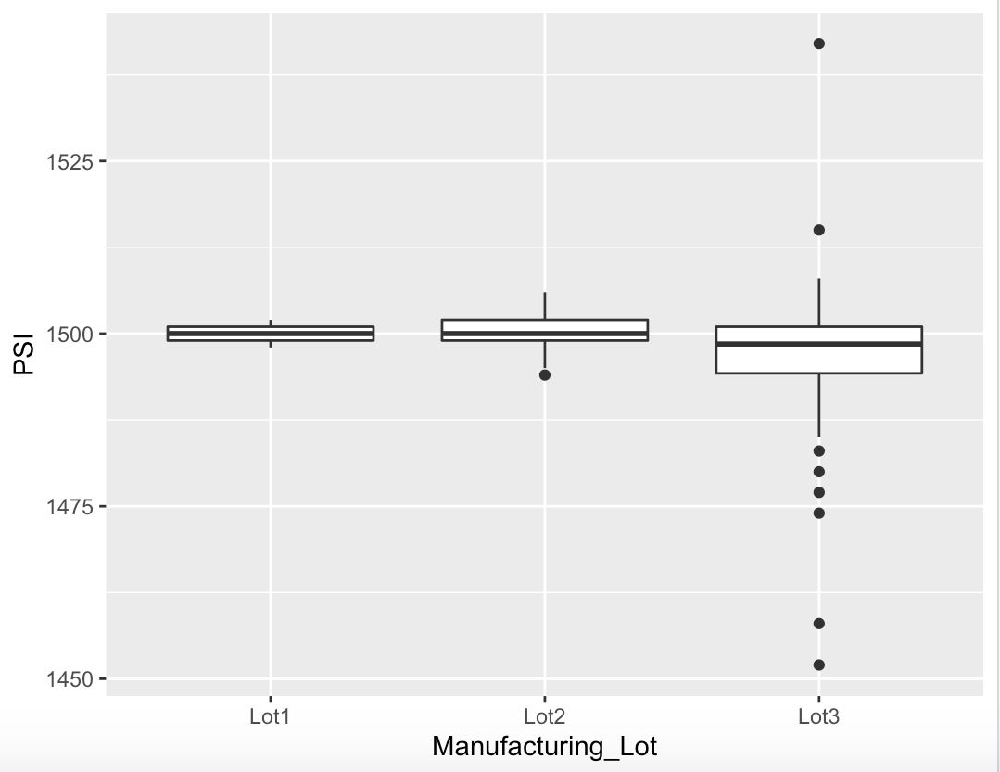
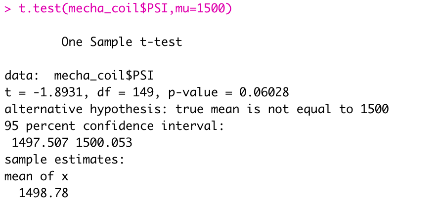
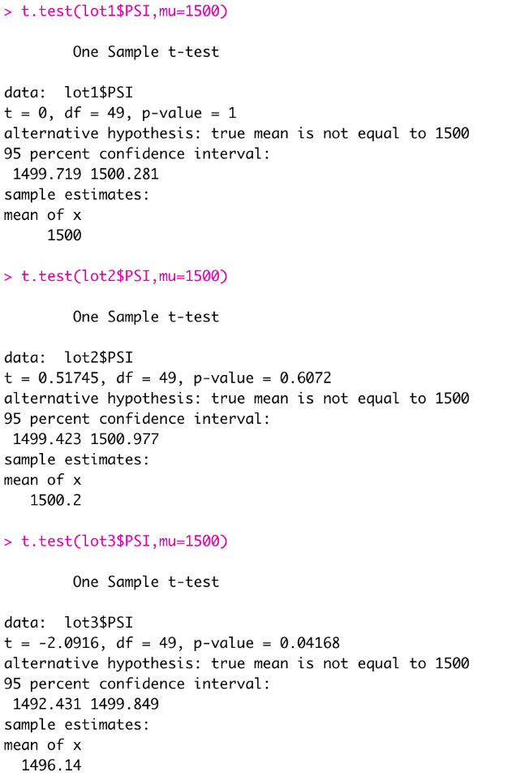

# MechaCar_Statistical_Analysis

## Overview of Project
A few weeks after starting his new role, Jeremy is approached by upper management about a special project. AutosRUs’ newest prototype, the MechaCar, is suffering from production troubles that are blocking the manufacturing team’s progress. AutosRUs’ upper management has called on Jeremy and the data analytics team to review the production data for insights that may help the manufacturing team.

In this challenge, you’ll help Jeremy and the data analytics team do the following:

* Perform multiple linear regression analysis to identify which variables in the dataset predict the mpg of MechaCar prototypes
* Collect summary statistics on the pounds per square inch (PSI) of the suspension coils from the manufacturing lots
* Run t-tests to determine if the manufacturing lots are statistically different from the mean population
* Design a statistical study to compare vehicle performance of the MechaCar vehicles against vehicles from other manufacturers. For each statistical analysis, you’ll write a summary interpretation of the findings.

## Deliverables:
This new assignment consists of three technical analysis deliverables and a proposal for further statistical study. You’ll submit the following:

1. ***Deliverable 1:*** Linear Regression to Predict MPG
2. ***Deliverable 2:*** Summary Statistics on Suspension Coils
3. ***Deliverable 3:*** T-Test on Suspension Coils
4. ***Deliverable 4:*** Design a Study Comparing the MechaCar to the Competition

# Deliverable 1:  
## Linear Regression to Predict MPG
### Deliverable Requirements:

The `MechaCar_mpg.csv` dataset contains mpg test results for 50 prototype MechaCars. The MechaCar prototypes were produced using multiple design specifications to identify ideal vehicle performance. Multiple metrics, such as vehicle length, vehicle weight, spoiler angle, drivetrain, and ground clearance, were collected for each vehicle. Using your knowledge of R, you’ll design a linear model that predicts the mpg of MechaCar prototypes using several variables from the `MechaCar_mpg.csv file`. 

> To Deliver. 

- The `MechaCar_mpg.csv` file is imported and read into a dataframe
- An RScript is written for a linear regression model to be performed on all six variables
- An RScript is written to create the statistical summary of the linear regression model with the intended p-values
- There is a summary that addresses all three questions

#### Results on Deliverable:
**Resulting Model:** 

### mpg =  (6.267)**vehicle_length** + (0.0012)**vehicle_weight** + (0.0688)**spoiler_angle** + (3.546)**ground_clearance** + (-3.411)**AWD** + (-104.0)

**Summary:** 


**Findings:** 

1. The **vehicle length**, and **vehicle ground clearance** statistically show the vehicle length and vehicle ground clearance have a significant impact on miles per gallon on the MechaCar prototype. Furthermore,
the **vehicle weight**, **spoiler angle**, and **All Wheel Drive** (AWD) have p-Values that indicate a random amount of variance with the dataset.  

2. The p-Value for this model, ```p-Value: 5.35e-11```, is much smaller than the assumed significance level of 0.05%. This indicates there is sufficient evidence to **reject our null hypothesis**, which further indcates that the slope of this linear model is **not zero**.

3.  Because the r-squared value in this model is 0.7149 , 71% of all mpg predictions will be determined by this model. Therefore multiple regression model **does predict mpg of MechaCar prototypes effectively**. 

If we remove the independent variables (vehicle weight, spoiler angle, and All Wheel Drive), the predictability does decrease, the r-squared value would fall from 0.7149 to 0.674.


# Deliverable 2:  
## Summary Statistics on Suspension Coils
### Deliverable Requirements:

The MechaCar Suspension_Coil.csv dataset contains the results from multiple production lots. In this dataset, the weight capacities of multiple suspension coils were tested to determine if the manufacturing process is consistent across production lots. Using your knowledge of R, you’ll create a summary statistics table to show:

- The suspension coil’s PSI continuous variable across all manufacturing lots
- The following PSI metrics for each lot: mean, median, variance, and standard deviation.

#### Technical Analysis
1. Download the `Suspension_Coil.csv` file, and place it in the active directory for your R session.
2. In your `MechaCarChallenge.RScript`, import and read in the `Suspension_Coil.csv` file as a table.
3. Write an RScript that creates a `total_summary` dataframe using the `summarize()` function to get the mean, median, variance, and standard deviation of the suspension coil’s PSI column.

Your `total_summary` dataframe results should look like this:


4. Write an RScript that creates a `lot_summary` dataframe using the `group_by()` and the `summarize()` functions to group each manufacturing lot by the mean, median, variance, and standard deviation of the suspension coil’s PSI column.
Your lot_summary dataframe results should look like this: 


5. Save your `MechaCarChallenge.RScript` file to your GitHub repository.

> To Deliver. 

- The Suspension_Coil.csv file is imported and read into a dataframe
- An RScript is written to create a total summary dataframe that has the mean, median, variance, and standard deviation of the PSI for all manufacturing lots
- An RScript is written to create a lot summary dataframe that has the mean, median, variance, and standard deviation for each manufacturing lot
- There is a summary that addresses the design specification requirement for all the manufacturing lots and each lot individually

The Suspension Coil dataset provided for the MechaCar contains the results of testing the weight capacities of multiple suspension coils from multiple production lots to determine consistency. 

All manufacturing lots:


Lots 1, 2, and 3:


With the understanding that the design specifications for the MechaCar suspension coils mandate that <mark style="background-color: Yellow">**the variance of the suspension coils cannot exceed 100 pounds per square inch (PSI)**</mark> . 

Does the current manufacturing data meet this design specification for all manufacturing lots in total and each lot individually? Why or why not?

When looking at the entire population of the production lot, the variance of the coils is 62.29 PSI, which is well within the 100 PSI variance requirement.  

Similarly, but significantly more consistent, Lot 1 and Lot 2 are well within the 100 PSI variance requirement; with variances of 0.98 and 7.47 respectively.  However, it is Lot 3 that is showing much larger variance in performance and consistency, with a variance of 170.29.  It is Lot 3 that is disproportionately causing the variance at the full lot level.  

Boxplot to emphasize the differences between the lots:



# Deliverable 3:  
## t-Tests on Suspension Coils
### Deliverable Requirements:

Using your knowledge of R, perform t-tests to determine if all manufacturing lots and each lot individually are statistically different from the population mean of 1,500 pounds per square inch.

#### Technical Analysis
1. In your `MechaCarChallenge.RScript`, write an RScript using the `t.test()` function to determine if the PSI across all manufacturing lots is statistically different from the population mean of 1,500 pounds per square inch.
2. Next, write three more RScripts in your `MechaCarChallenge.RScript` using the `t.test()` function and its `subset()` argument to determine if the PSI for each manufacturing lot is statistically different from the population mean of 1,500 pounds per square inch.

- An RScript is written for t-test that compares all manufacturing lots against mean PSI of the population
- An RScript is written for three t-tests that compare each manufacturing lot against mean PSI of the population
- There is a summary of the t-test results across all manufacturing lots and for each lot

Summary of the t-test results across all manufacturing lots:



From here we can see the **true mean of the sample is 1498.78**, which we also saw in the summary statistics above.  With a **p-Value of 0.06**, which is higher than the common significance level of 0.05, there is **NOT enough evidence to support rejecting the null hypothesis**.  The mean of all three of these manufacturing lots is statistically similar to the presumed population mean of 1500. 

**Each individual lots:**

1. Lot 1 sample actually has the **true sample mean of 1500**, again as we saw in the summary statistics above. With a **p-Value of 1**, clearly we cannot reject (i.e. accept) the null hypothesis that there is no statistical difference between the observed sample mean and the presumed population mean (1500).
2. Lot 2 has essentially the same outcome with a **sample mean of 1500.02**, a **p-Value of 0.61**; the null hypothesis cannot be rejected, and the sample mean and the population mean of 1500 are statistically similar.
3. Lot 3 is a different scenario. Here **the sample mean is 1496.14** and the **p-Value is 0.04**, which is lower than the common significance level of 0.05.  All indicating to **reject the null hypothesis** that this sample mean and the presumed population mean are not statistically different.



# Deliverable 4:  
## Study Design: MechaCar vs Competition
### Deliverable Requirements:

Using your knowledge of R, design a statistical study to compare performance of the MechaCar vehicles against performance of vehicles from other manufacturers.

The statistical study design has the following:
- A metric to be tested is mentioned
- A null hypothesis or an alternative hypothesis is described
- A statistical test is described to test the hypothesis


This study would involve collecting data on MechaCar and its comparable models across several different manufacturers over the last 3 years.

* What are the competitions' comparable models, 
* Which cars will MechaCar be competing with head-to-head? which cars will be included in the study?
* Which factors will look at the study to determine the relevant to selling price?
 

#### Metrics
Collecting data for comparable models across all major manufacturers for past 3 years for the following metrics:

*  Safety Feature Rating: **Independent Variable**
*  Current Price (Selling): **Dependent Variable**
*  Drive Package : **Independent Variable**
*  Engine (Electric, Hybrid, Gasoline / Conventional): **Independent Variable**
*  Resale Value: **Independent Variable**
*  Average Annual Cost of ownership (Maintenance): **Independent Variable**
*  MPG (Gasoline Efficiency): **Independent Variable**


#### Hypothesis: Null and Alternative
After determining which factors are key for the MechaCar's genre:

 * Null Hypothesis (Ho): MechaCar is priced correctly based on its performance of key factors for its genre.
 * Alternative Hypothesis (Ha): MechaCar is NOT priced correctly based on performance of key factors for its genre.
 
#### Statistical Tests
A **multiple linear regression** would be used to determine the variables that have the largest connection with the listed selling price, and would determine which would have has the greatest impact on price.

